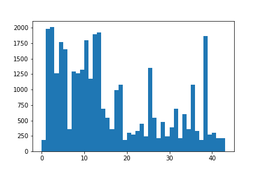
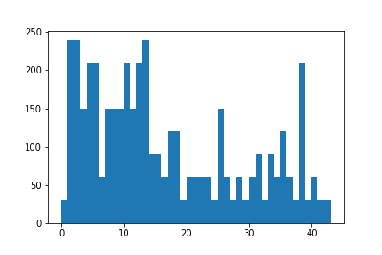

# **Traffic Sign Recognition** 

## Writeup

---

The goals / steps of this project are the following:
* Load the data set (see below for links to the project data set)
* Explore, summarize and visualize the data set
* Design, train and test a model architecture
* Use the model to make predictions on new images
* Analyze the softmax probabilities of the new images
* Summarize the results with a written report

## Rubric Points
### Here I will consider the [rubric points](https://review.udacity.com/#!/rubrics/481/view) individually and describe how I addressed each point in my implementation.  

---
### Writeup / README

#### 1. Provide a Writeup / README that includes all the rubric points and how you addressed each one. You can submit your writeup as markdown or pdf. You can use this template as a guide for writing the report. The submission includes the project code.

You're reading it! My project code is included in the same folder with this write up, named after "Traffic_Sign_Classfier.ipynb". And the corresponding HTML file is also included, named after"Traffic_Sign_Classifier_092118_Submission.html".

### Data Set Summary & Exploration

#### 1. Provide a basic summary of the data set. In the code, the analysis should be done using python, numpy and/or pandas methods rather than hardcoding results manually.

I used the pandas library to calculate summary statistics of the traffic
signs data set:

* The size of training set is n_train = 34799
* The size of the validation set is n_validation = 4410
* The size of test set is n_test = 12630
* The shape of a traffic sign image is shape = (32, 32, 3)
* The number of unique classes/labels in the data set is n_classes = 43

#### 2. Include an exploratory visualization of the dataset.

Here is an exploratory visualization of the train, validation and test data set. It is a histogram showing how the images map to their labels/classes.

According to the histogram, in the train data set,  Label 2 has largest number of images, followed by Label 1 and Label 13; On the other hand, Label 0, 19 and 37 have the least number of images.

For the validation data set, Label 1, 2 and 13 have the largest number of images.

For the test data set, similar to the previous data set, namely, Label 1, 2 and 13 have the largest number of images.

### Design and Test a Model Architecture

#### 1. Describe how you preprocessed the image data. What techniques were chosen and why did you choose these techniques? Consider including images showing the output of each preprocessing technique. Pre-processing refers to techniques such as converting to grayscale, normalization, etc. (OPTIONAL: As described in the "Stand Out Suggestions" part of the rubric, if you generated additional data for training, describe why you decided to generate additional data, how you generated the data, and provide example images of the additional data. Then describe the characteristics of the augmented training set like number of images in the set, number of images for each class, etc.)

I decided to keep the image in RGB, as the color information would help in the classification. For instance, red would mean something related to "Stop" or "Limit".

I only chose to normalize the image, as images with a mean of zero and an equal variance would help the optimizer find a good solution with less processing time.

Taking the following two images as an example, they are showing the same information, but they have different lightness. Normalization would help in this case.

To produce a correct normalization result, input images were first converted to np.float32.

Normalization is implemented as the following:

x_normalized = (x_original - 128)/128

Where x_original stands for original image, and x_normalized stands for normalized image.

I chose not use an augmented image set.

#### 2. Describe what your final model architecture looks like including model type, layers, layer sizes, connectivity, etc.) Consider including a diagram and/or table describing the final model.

My final model consisted of the following layers:

| Layer         		|     Description	        					| 
|:---------------------:|:---------------------------------------------:| 
| Input         		| 32x32x3 RGB image   							| 
| Convolution 5x5     	| 1x1 stride, valid padding, outputs 28x28x16 	|
| RELU					|												|
| Max pooling	      	| 2x2 stride,  outputs 14x14x16 				|
| Convolution 3x3	    | 1x1 stride, valid padding, outputs 12x12x48 	|
| RELU					|												|
| Max pooling			| 2x2 stride,  outputs 6x6x48					|
| Convolution 3x3		| 1x1 stride, same padding, outputs 6x6x144		|
| RELU					|												|
| Max pooling			| 2x2 stride,  outputs 3x3x144					|
| Flatten				| inputs 3x3x144, outputs 1296					|
| Fully connected 1		| inputs 1296, outputs 432						|
| RELU					|												|
| Fully connected 2		| inputs 432, outputs 108 						|
| RELU					|												|
| Fully connected 3		| inputs 108, outputs 43						|
| Softmax				| inputs 43, outputs 43 						|

#### 3. Describe how you trained your model. The discussion can include the type of optimizer, the batch size, number of epochs and any hyperparameters such as learning rate.

To train the model, I chose cross entropy as the loss function, and used an Adam optimizer with default parameter setting. Adam combines the best properties of the AdaGrad and RMSProp algorithms to provide an optimization algorithm.

The batch size was 128 based on memory limit and performance consideration. 

The number of epochs was chosen as 30. It was showed during test that, the prediction accuracy would become stable at around 0.95 after 20 to 25 epochs of training.

The learning rate was set as 0.0008. Both 0.001 and 0.0005 were tried as for learning rate, it turned out that both of them produced worse results than learning rate = 0.0008.

#### 4. Describe the approach taken for finding a solution and getting the validation set accuracy to be at least 0.93. Include in the discussion the results on the training, validation and test sets and where in the code these were calculated. Your approach may have been an iterative process, in which case, outline the steps you took to get to the final solution and why you chose those steps. Perhaps your solution involved an already well known implementation or architecture. In this case, discuss why you think the architecture is suitable for the current problem.

My final model results were:
* training set accuracy of 1.000
* validation set accuracy of 0.950
* test set accuracy of 0.946

An iterative approah was taken in this project.

The LeNet-5 architecture was first taken in this project, based on the fact that it performed very well on the MNIST digit data, and convolution layer worked very well on image classification.

However, this architecture could not produce an acceptable result. The validation accuracy was lower than 0.9.

Considering that the input images have three color channels, and the outputs have 43 classes, which are both larger than the digits problem, a third convolution layer was embedded in the improved architecture. A RELU activation layer and a maxpooling layer came after the third convolution layer.

For the first convolution layer, a filter with kernal size = 5 was chosen, stride was 1, and padding was "VALID". This was because the images with traffic sign information are mainly in the centeral area, and a larger kernal size would help reduce processing time while keep key information.For the second convolution layer, a fitler with kernal size = 3 was chosen, stride was 1, and padding was "VALID".For the third convolution layer, a filter with kernal size = 3 was chosen, stride was 1, and padding was "SAME" to help keep key information.

These three layers were set as 16, 48 and 144, based on experiences that the number of next layer equals to two or three times of the previous layer.

A RELU activation layer was chosen after each convolution layer, as it generally has a good performance in deep learning. The maxpooling layer after each RELU activation layer is with kernal size 2 and stride 2.

At the beginning, two dropout layers were implemented in the model, one came after the first fully connected layer, and the other one came after the second fully connected layer, with dropout rate 0.1 and 0.05. However, it turned out that the implementation of dropout layer had lowered the accuracy for train, test and validation set when compared with accuracy without dropout layers. Thus dropout layers in the model would lead to a underfitting situation, and they were taken off from the final model. 

### Test a Model on New Images

#### 1. Choose five German traffic signs found on the web and provide them in the report. For each image, discuss what quality or qualities might be difficult to classify.

Ten German traffic sign images that I found on the web were tested , and here are five of them:

![Speed Limit (30Km/h)][new_test1](/Output_images/new_test1.png "Speed Limit (30Km/h)")
![General Caution][new_test4](/Output_images/new_test4.png "Genral Caution")
![Traffic Signals][new_test5](/Output_images/new_test5.png "Traffic Signals")
![Wild Animals Crossing][new_test6](/Output_images/new_test6.png "Wild Animals Crossing")
![Right-of-way at Next Interaction][new_test8](/Output_images/new_test8.png "Right-of-way at Next Interaction")

The first and last image might be difficult to classify because the image quality is pretty low. The second image might be difficult to classify because the environment is pretty dark. The third image has color of traffic signals. The fourth and last image might look similar in some instance.

#### 2. Discuss the model's predictions on these new traffic signs and compare the results to predicting on the test set. At a minimum, discuss what the predictions were, the accuracy on these new predictions, and compare the accuracy to the accuracy on the test set (OPTIONAL: Discuss the results in more detail as described in the "Stand Out Suggestions" part of the rubric).

Here are the results of the prediction:

| Image			                            |     Prediction	        					| 
|:-----------------------------------------:|:---------------------------------------------:| 
| Speed Limit (30Km/h)              		| Speed Limit (30Km/h)   						| 
| Genral Caution                			| Genral Caution 								|
| Traffic Signals       					| Traffic Signals								|
| Wild Animals Crossing	            		| Wild Animals Crossing					 		|
| Right-of-way at Next Interaction			| Right-of-way at Next Interaction 				|

The model was able to correctly predict 5 of the 5 traffic signs, which gives an accuracy of 100%. This compares favorably to the accuracy of 0.946 on the test set.

#### 3. Describe how certain the model is when predicting on each of the five new images by looking at the softmax probabilities for each prediction. Provide the top 5 softmax probabilities for each image along with the sign type of each probability. (OPTIONAL: as described in the "Stand Out Suggestions" part of the rubric, visualizations can also be provided such as bar charts)

The code for making predictions on my final model is located in the In[48] cell of the Ipython notebook.

For the first image, the model is sure that this is a Speed Limit (30Km/h) sign (probability of 1.000), and the image does contain a vague 30. It could also be found that second to fourth most possible predictions are also speed limit signs. The top five soft max probabilities were

| Probability         	|     Prediction	        					| 
|:---------------------:|:---------------------------------------------:| 
| 1.000        			| Speed Limit (30Km/h)   						| 
| 0.0     				| Speed Limit (50Km/h) 							|
| 0.0					| Speed Limit (80Km/h)							|
| 0.0	      			| Speed Limit (70Km/h)							|
| 0.0				    | Roads Narrows on the Right      				|

For the second image, the model is pretty sure that this is a General Caution sign (probability of 0.998), and the image does reflect a General Caution sign. The top five soft max probabilities were

| Probability         	|     Prediction	        					| 
|:---------------------:|:---------------------------------------------:| 
| 0.998        			| General Caution       						| 
| 0.002     			| Traffic Signals 								|
| 0.0					| Pedestrians									|
| 0.0	      			| Keep Right					 				|
| 0.0				    | Right-of-way at the Next Intersection			|

For the third image, the model is sure that this is a Traffic Signals sign (probability of 1.000), and the image does reflect a Traffic Signals sign. The top five soft max probabilities were

| Probability         	|     Prediction	        					| 
|:---------------------:|:---------------------------------------------:| 
| 1.000        			| Traffic Signals       						| 
| 0.0     				| Children Crossing 							|
| 0.0					| Keep Right									|
| 0.0	      			| Turn Right Ahead								|
| 0.0				    | Road Work      								|

For the fourth image, the model is sure that this is a Wild Animal Crossing sign (probability of 1.000), and the image does reflect a Wild Animal Crossing sign. The top five soft max probabilities were

| Probability         	|     Prediction	        					| 
|:---------------------:|:---------------------------------------------:| 
| 1.000        			| Wild Animal Crossing   						| 
| 0.0     				| Double Curve 									|
| 0.0					| Slippery Road									|
| 0.0	      			| Bicycles Crossing					 			|
| 0.0				    | Beware of Ice/Snow      						|

For the fifth image, the model is sure that this is a Right-of-way at Next Interaction sign (probability of 1.000), and the image does reflect a Right-of-way at Next Interaction sign. The top five soft max probabilities were

| Probability         	|     Prediction	        					| 
|:---------------------:|:---------------------------------------------:| 
| 1.000        			| Right-of-way at Next Interaction 				| 
| 0.0     				| Pedestrians 									|
| 0.0					| Dangerous Curve to the Right					|
| 0.0	      			| Beware of Ice/Snow							|
| 0.0				    | General Caution      							|

### (Optional) Visualizing the Neural Network (See Step 4 of the Ipython notebook for more details)
#### 1. Discuss the visual output of your trained network's feature maps. What characteristics did the neural network use to make classifications?

I was not able to visualize the output of my trained network's feature maps. I did get a error that tf_activation was not defined, and I guess it would be due to having trouble accessing the variable from inside a function.

I tried tf.add_to_collection / tf. get_collection, but unfortunately it did not work. I also tried tf.GraphKeys.GLOBAL_VARIABLES and tf.GraphKeys.VARIABLES, they returned the variables in a specific names, but I am not sure which one represents the convolution layers.

One way came to my mind to solve this issue is to define the network as class, but this would require a total reconstruction of the network.
